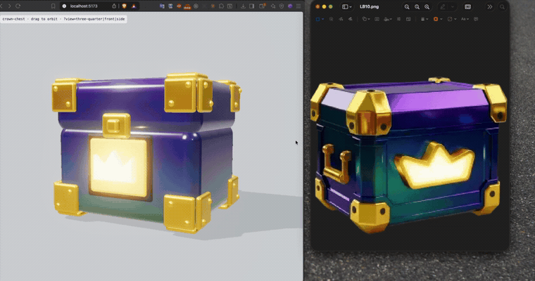
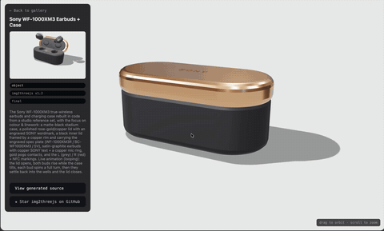
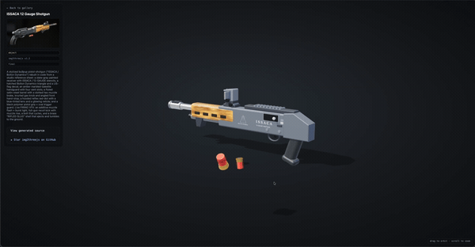
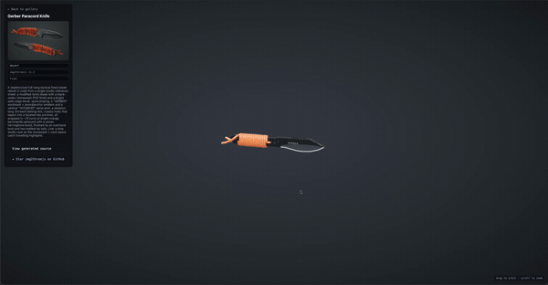
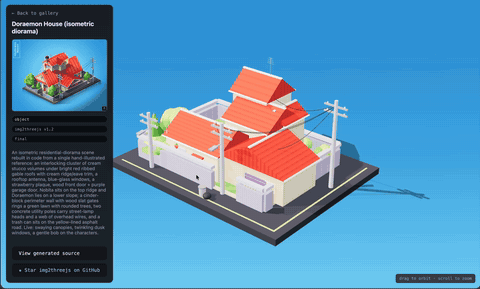
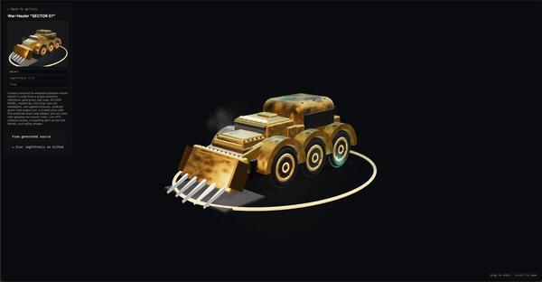
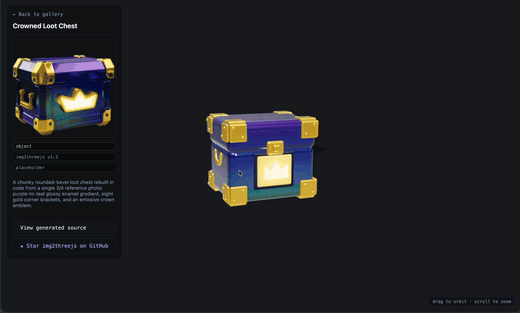
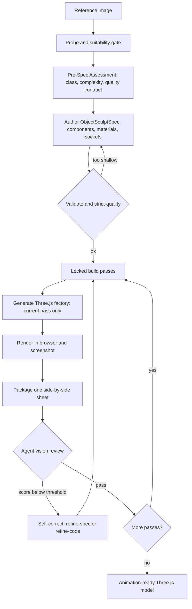

<div align="center">


# img2threejs

**Rebuild the object in a reference image as a code-only, procedural Three.js model.**

Quality-gated, animation-ready, and deliberately token-efficient — reconstruction-by-code, not photogrammetry, mesh extraction, or downloaded art packs.

[](LICENSE)
[](SKILL.md)
[](CONTRIBUTING.md)
[](https://threejs.org)
[](scripts)



</div>

*A single reference image reconstructed in code — correct proportions, colours, bevels, gold trim, and an emissive emblem — running live in the browser.*

### [→ Open the Live Demo Gallery](https://hoainho.github.io/img2threejs-showcase/)

Every model in the gallery is generated code, running in your browser. No mesh files, no downloads.

---

## Live demos

Reconstructions built entirely from primitives, procedural shaders, and generated geometry. The clips below are the live models running in-browser — open each one to orbit it and read the generated source.

| Demo | Preview | Subject | View | Source |
| --- | --- | --- | --- | --- |
| Sony WF-1000XM3 Earbuds + Case |  | hard-surface object | [Live](https://hoainho.github.io/img2threejs-showcase/#/demo/sony-wf1000xm3) | [code](https://github.com/hoainho/img2threejs-showcase/blob/main/src/demos/sony-wf1000xm3/createSonyWf1000xm3Model.ts) |
| ISSACA 12 Gauge Shotgun |  | hard-surface object | [Live](https://hoainho.github.io/img2threejs-showcase/#/demo/issaca-shotgun) | [code](https://github.com/hoainho/img2threejs-showcase/blob/main/src/demos/issaca-shotgun/createIssacaShotgunModel.ts) |
| Gerber Paracord Knife |  | hard-surface object | [Live](https://hoainho.github.io/img2threejs-showcase/#/demo/gerber-knife) | [code](https://github.com/hoainho/img2threejs-showcase/blob/main/src/demos/gerber-knife/createGerberKnifeModel.ts) |
| Doraemon House (isometric diorama) |  | hard-surface object | [Live](https://hoainho.github.io/img2threejs-showcase/#/demo/doraemon-house) | [code](https://github.com/hoainho/img2threejs-showcase/blob/main/src/demos/doraemon-house/createDoraemonHouseModel.ts) |
| War-Hauler "SECTOR 07" |  | hard-surface object | [Live](https://hoainho.github.io/img2threejs-showcase/#/demo/warhauler) | [code](https://github.com/hoainho/img2threejs-showcase/blob/main/src/demos/warhauler/createWarHaulerModel.ts) |
| Crowned Loot Chest |  | hard-surface object | [Live](https://hoainho.github.io/img2threejs-showcase/#/demo/crown-chest) | [code](https://github.com/hoainho/img2threejs-showcase/blob/main/src/demos/crown-chest/createCrownChestModel.ts) |

The gallery source lives in [hoainho/img2threejs-showcase](https://github.com/hoainho/img2threejs-showcase). If this project is useful, a star on this repo helps others find it.

---

## What it does

You give it one reference image of an object. It produces a `THREE.Group` factory written in TypeScript that recreates that object from primitives, procedural shaders, and generated geometry — with a runtime hierarchy (pivots, sockets, colliders) so the result is ready to animate, not an inert lump.

It runs under Claude Code, Codex, or OpenCode. It is agent-agnostic: wherever the docs say "agent vision" or "agent browser tool", it uses whatever the host provides — native image reading, a browser MCP, the project preview, or a user-supplied screenshot.

### Subjects and detail accuracy

- **Objects and characters.** Each subject is classified `object`, `character`, or `hybrid`. Objects follow the hard-surface pipeline; characters route through an anatomy-aware track (head-unit proportions, facial landmarks, pose) documented in `grimoire/character/reconstruction.md`.
- **Detail-first analysis.** Before code generation the pipeline enumerates a `detailInventory` of identity-defining small details (gloss, bevel/rounding, screws/rivets, engraved or painted linework, contours, stains and wear). Every detail must map to a real component or material entry, and a strict-quality gate blocks generation until the inventory is complete. Taxonomy: `grimoire/intake/detail_inventory.md`.
- **Maximum likeness for a specific person or character.** An opt-in projection-first path fits a parametric template to image landmarks, de-lights the photo, camera-matches the render, and projects the reference onto the mesh. A single image cannot guarantee 100 percent likeness, so the pipeline reports per-region confidence and asks for more views when it matters. Details: `grimoire/character/likeness_maximization.md`.

---

## How it works

The skill runs a staged sculpting pipeline. Scripts gate each stage; the agent's vision is the only thing that can approve a pass.



### Build passes

The model is sculpted in a fixed order; a pass unlocks only after the previous one is reviewed and accepted:

`blockout → structural-pass → form-refinement → material-pass → surface-pass → lighting-pass → interaction-pass → optimization-pass`

Each pass has its own acceptance criteria. A pass is marked `continue` only with a real render, a comparison sheet, an agent-vision score at or above threshold, and every identity-defining feature at or above its own threshold.

### The gates

- **Suitability** — is the image a viable 3D target at all.
- **Pre-spec and strict-quality** — blocks code generation until the spec is deep enough for the object's complexity (no single-root spec for a compound object).
- **Screenshot feedback** — `continue` requires a render plus a comparison sheet plus a passing vision score.
- **Action-ready** — the model exposes a runtime hierarchy (pivots, sockets, colliders, destruction groups) via `root.userData.sculptRuntime`.
- **Attachment correctness** — child parts (handles, limbs, tubes) declare how they join their parent, so nothing floats in mid-air.
- **Material and lighting realism** — independent PBR channels and real lights, never albedo aliased into roughness.

### Self-correction

After every pass the agent chooses exactly one action: `continue`, `refine-spec`, `refine-code`, `request-input`, or `stop`. `refine-spec` fixes a wrong or shallow spec and re-validates; `refine-code` fixes geometry, material, or lighting that does not match a sound spec.

---

## Quick start

1. **Install** — place this folder in your skills directory:

   ```bash
   git clone https://github.com/hoainho/img2threejs.git ~/.claude/skills/img2threejs
   ```

2. **Invoke** — in Claude Code, attach or point to an object image and run:

   ```
   /img2threejs Rebuild this object as a Three.js model, keep the proportions, angles, and colours.
   ```

3. **Follow the pipeline** — the skill validates the image, writes an assessment and spec, generates the factory pass by pass, and shows you a side-by-side comparison at each step until the render matches.

The scripts run from the skill root and need only Python 3.10+ — nothing to install.

```bash
python3 forge/stage1_intake/probe_image.py <image>
python3 forge/stage2_spec/new_pre_spec_assessment.py "Name" --image <image> --out assessment.json
python3 forge/stage2_spec/new_sculpt_spec.py "Name" --image <image> --assessment assessment.json --out spec.json
python3 forge/stage2_spec/validate_sculpt_spec.py spec.json --strict-quality
python3 forge/stage3_build/generate_threejs_factory.py spec.json --out src/createObjectModel.ts
```

---

## Why it is token-efficient

Most image-to-3D agent loops burn tokens by asking the model to do mechanical work — re-reading the whole model every pass, scoring pixels, validating JSON by hand, re-running steps it already did. img2threejs pushes all of that into deterministic scripts and spends model tokens only where judgment is actually required.

- **Scripts enforce, the model judges.** The Python scripts handle validation, gating, spec authoring, PBR extraction, comparison-sheet packaging, and pipeline state. They never score visuals. The model's tokens go to one thing: looking at a single side-by-side sheet and deciding pass or fail.
- **Zero dependencies, zero install churn.** Every script is pure Python 3.10+ standard library. No pip, no PIL, no numpy, no Playwright. PNG read/write is done with `struct` and `zlib`. Nothing to install means nothing to debug in-context.
- **Pass-gated generation.** The code generator emits only the currently unlocked build pass. The model does not regenerate or re-read the entire model on every iteration — each step is small and scoped.
- **Fail fast, before codegen.** A strict-quality gate blocks shallow specs before a single line of Three.js is generated, so you never spend tokens rendering a model that was underspecified from the start.
- **One image per review.** Each pass is judged from exactly one packaged comparison sheet (reference beside render), not a scattering of screenshots.
- **Text output, not binaries.** The result is diffable TypeScript plus a JSON spec — small, reviewable, and version-controllable, instead of multi-megabyte mesh files.

The net effect: you still get a faithful 3D model from an image, but the expensive model context is reserved for visual judgment and code, not bookkeeping. For the full per-stage and per-cycle token breakdown, see [docs/TOKEN_COST.md](docs/TOKEN_COST.md).

---

## Scripts

| Script | Role |
| --- | --- |
| `stage1_intake/probe_image.py` | Image metadata and obvious technical issues (not a visual check). |
| `stage2_spec/new_pre_spec_assessment.py` | Classify the object, score complexity, emit a quality contract. |
| `stage2_spec/new_sculpt_spec.py` | Author the ObjectSculptSpec from the assessment. |
| `stage2_spec/validate_sculpt_spec.py` | Validate the spec; `--strict-quality` blocks shallow specs before codegen. |
| `stage1_intake/extract_pbr_evidence.py` | Reference-derived PBR evidence per crop (inference, not inverse rendering). |
| `stage3_build/orchestrate_passes.py` | Locked pass state: status, check, sync. |
| `stage3_build/generate_threejs_factory.py` | Emit the Three.js `Group` factory for the current unlocked pass. |
| `stage4_review/make_comparison_sheet.py` | Package one reference-vs-render sheet for review. |
| `stage4_review/append_review.py` | Record a per-pass review: scores, decision, evidence. |
| `_shared/feature_acceptance_policy.py` | Internal helper enforcing per-feature score thresholds. |
| `stage1_intake/build_detail_inventory.py` | Slice the reference into zones and scaffold a detail inventory. |
| `stage1_intake/extract_landmarks.py` | Overlay a landmark grid and scaffold an anatomy block for characters. |
| `stage1_intake/solve_camera_pose.py` | Emit a reference-camera block so the render can be camera-matched. |
| `stage1_intake/delight_albedo.py` | Approximate a neutral albedo from the photo before texture projection. |
| `stage3_build/bake_projected_texture.py` | Emit a projection/UV-bake descriptor for photo-texture projection. |

The `grimoire/` folder holds the detailed rubrics each gate applies (validation, pre-spec assessment, procedural patterns, material and lighting realism, attachment correctness, action-ready models, self-correction).

---

## What you get

- An `ObjectSculptSpec` JSON: the full component tree, materials, repetition systems, sockets, and a recorded review history for every pass.
- A TypeScript `createObjectNameModel(spec, options)` factory returning a `THREE.Group`, with `root.userData.sculptRuntime` exposing nodes, sockets, colliders, and destruction groups.
- A render plus comparison sheets documenting the fidelity at each pass.

---

## Roadmap

- **v1.0** — object pipeline: staged sculpt, render-vs-reference review loop, action-ready hierarchy. *Shipped.*
- **v1.1** — detail-first analysis: required detail inventory, strict-quality gate. *Shipped.*
- **v1.2** — humanoid character generator: anatomy track, proportion-lock and feature-placement passes. *Shipped.*
- **v1.3** — likeness maximization: projection-first character rendering, per-region confidence. *Planned.*
- **v1.4** — animation-ready rigs: SkinnedMesh, morph targets, glTF export. *Planned.*

Full detail and later milestones: [ROADMAP.md](ROADMAP.md). Technical specification: [docs/UPGRADE_PLAN.md](docs/UPGRADE_PLAN.md).

---

## Honesty about limits

A single image cannot reveal hidden sides or guarantee exact geometry. The skill states plainly when output is approximate, stylized, or low-poly, and infers unseen faces by mirroring visible ones rather than faking confidence. It is strong for hard-surface objects; characters are stylized reconstructions, not photoreal likeness. "This cannot reach the requested fidelity from this image" is a valid, expected result.

---

## Contributing

Contributions are welcome — procedural material recipes, new gates, host coverage, and demos especially. See [CONTRIBUTING.md](CONTRIBUTING.md) and the [roadmap](ROADMAP.md) for where the project is headed.

## License

MIT. See [LICENSE](LICENSE).
