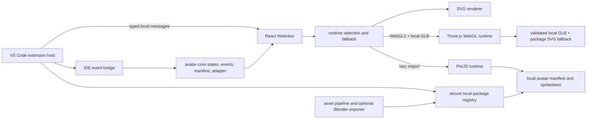

# Architecture — Codex Avatar Studio

Codex Avatar Studio is a pnpm TypeScript workspace that separates IDE integration, the React Webview, shared avatar contracts, and optional renderers. The MVP is local-first: SVG is always available, while PixiJS is the required rich runtime and is loaded lazily.

## System map



## Workspace topology

```text
apps/
  extension/          VS Code extension host, commands, settings, IDE events, Webview provider
  webview/            React/Vite UI, bridge, renderer selection, SVG fallback
packages/
  avatar-core/        states, triggers, capabilities, protocol, manifest validation, adapter contract
  asset-pipeline/     local image-to-SVG processing and manifest generation
  runtime-pixi/       isolated PixiJS v8 adapter, spritesheet validation, animation controller, cache
scripts/
  blender/            optional Blender SVG, GLB, and PNG exporters
```

## Runtime flow

1. The extension host listens to IDE events and user commands.
2. A versioned, schema-validated local bridge sends state, trigger, pose, and visibility messages to the Webview.
3. The Webview selects a renderer from the avatar manifest and user settings.
4. SVG renders immediately as the permanent fallback. PixiJS and the Three.js WebGL renderer are dynamically imported only when requested; `GLTFLoader` is deferred until WebGL2 and a local GLB entrypoint are confirmed.
5. A runtime failure, invalid local asset, or unsupported GPU returns control to SVG without taking down the assistant panel.
6. Visibility changes pause continuous animation; `dispose` removes canvases, observers, event listeners, and cached textures.

## Security boundaries

- Avatar packages are copied into `.codex-avatar/avatars/<id>/` only after manifest, path, checksum, SVG, size, and symlink validation.
- Webview resources use local VS Code URIs and a strict nonce-based CSP.
- The bridge accepts only known message schemas and bounded values.
- Blender is an optional trusted-workspace process launched with argument arrays and `shell: false`.
- Blender export modes validate and publish independently. A validated GLB is selectable only beside a package-local sanitized SVG fallback; otherwise the package stays SVG-only. The reverse handoff accepts only the current sanitized workspace SVG and creates a new staged `.blend` curve scene before returning to the export flow.
- No remote runtime downloads, telemetry, cloud asset service, or microphone permission is required.

See [SECURITY_PRIVACY.md](SECURITY_PRIVACY.md) and [AVATAR_PACKAGE_SPEC.md](AVATAR_PACKAGE_SPEC.md) for the enforceable details.

## Performance boundaries

The default animation cap is 30 FPS; 60 FPS is opt-in. The Pixi runtime bounds canvas dimensions to 2048×2048 logical pixels at a maximum 2× resolution, limits its texture cache to 8 entries and 32 MiB estimated RGBA memory, pauses while hidden, and fails initialization after the Webview's 8-second timeout. See [PERFORMANCE.md](PERFORMANCE.md).

## Extension and Webview responsibilities

The extension owns VS Code APIs, settings, package import, filesystem policy, IDE event mapping, and process launch. The Webview owns presentation and renderer lifecycle. Shared types prevent renderer-specific state names from leaking into the IDE event bridge.

The optional WebGL path is isolated behind feature detection and local package validation. Rive, Live2D, WebGPU, Inochi2D, and VRM remain deferred and must not become prerequisites for SVG or Pixi.

## Historical audit

Earlier greenfield and runtime-first plans are preserved in Git history. The current repository state and remaining product connections are tracked only in [`PLAN_CHECKLIST.md`](PLAN_CHECKLIST.md).
