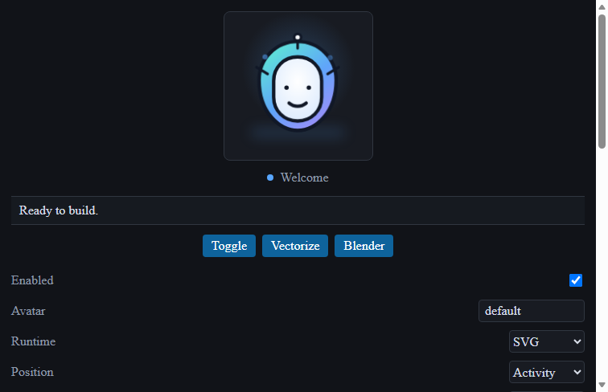

# Original Demo Walkthrough

The repository includes an original geometric orb avatar and a reproducible local smoke path. No third-party character, model, voice, or screenshot was copied for this demo.



This screenshot is generated from the local Webview smoke test with GPU disabled. To regenerate it, run `SMOKE_SCREENSHOT=docs/assets/webview-smoke.png pnpm run smoke:webview` (PowerShell users can set the environment variable with `$env:SMOKE_SCREENSHOT = "docs/assets/webview-smoke.png"`).

## Run the demo

From the repository root:

```bash
pnpm run ci
pnpm run smoke:webview
pnpm run package:vsix
pnpm run validate:vsix
pnpm run smoke:vsix
```

The Webview smoke opens the built local Webview in a temporary Edge profile with GPU disabled and verifies that the avatar panel, stage, initial `welcome` state, and “Ready to build.” message render. The VSIX smoke extracts the exact package artifact into a temporary directory, activates it with a VS Code API mock, exercises Webview messages and commands, and disposes the extension.

## Manual sequence

1. Open the assistant and observe the original SVG/Pixi orb in `welcome`.
2. Run `Codex Avatar: Set State` → `thinking`, then `speaking`, then `success`.
3. Run `Codex Avatar: Trigger Blink` and `Codex Avatar: Trigger Celebrate`.
4. Save a file, start a task, and finish it to observe IDE-event state changes.
5. Enable reduced motion or `noAnimation`, then reload the avatar.
6. Switch to SVG to verify the fallback remains available.

For a visual architecture map, see [ARCHITECTURE.md](ARCHITECTURE.md). For a package-building example, see [SPRITESHEET_GUIDE.md](SPRITESHEET_GUIDE.md).
