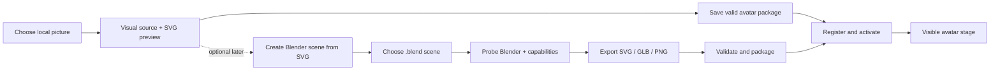

# Codex Avatar Studio — Final Implementation Plan

> This is the only authoritative implementation plan for the repository. It supersedes the three former root plans and the legacy checklist. Their history remains available in Git.

**Updated:** 2026-07-14

**Current state:** Phases 0–11 and their release gates are complete. Phase 12 is now the active required phase: add the restricted project Blender MCP workflow, productize the optional WebGL runtime, and create the local-only professional 3D Cholita package without redistributing its assets.

**Next required phase:** Phase 12. Do not start another deferred runtime until its checklist and evidence are complete.

## 1. Product outcome

Codex Avatar Studio must let a user choose a local picture, convert it to a safe SVG, save it as a valid avatar package, and immediately see it as the active IDE avatar. Blender must be a connected but optional local production tool for SVG line art, GLB, and PNG previews.

The required user journeys are:

1. **Picture → SVG avatar:** choose a picture, preview it, vectorize it locally, save it as an avatar, activate it, and keep it active after reload.
2. **Blender → avatar assets:** detect or configure Blender, export a `.blend` scene, validate the results, package supported output, and optionally activate it.
3. **Manage avatars:** import, select, validate, reload, reveal, export, and remove local avatar packages from the Webview without relying on hidden commands.

“Upload” means choosing a local file. No picture, model, SVG, or Blender file is sent to a server.

## 2. Decisions that are now locked

- Preserve the working extension, Webview, SVG/Pixi foundation, state machine, package registry, and tests. This is not a greenfield rebuild.
- SVG is the permanent fallback and the first custom-asset runtime to complete.
- PixiJS remains the existing rich 2D runtime. Rive, Live2D, Inochi2D, VRM, WebGPU, and voice work cannot block the picture-to-SVG or Blender journeys.
- The extension host owns file pickers, filesystem access, package installation, Blender processes, and local URI conversion. The Webview owns presentation and sends only typed requests.
- Use the current versioned bridge, `AvatarManifest`, state names, and trigger names as the source of truth. Change them only through an explicit schema migration.
- Generated and imported assets remain local under the configured `.codex-avatar` workspace directory.
- Preserve source pictures and `.blend` files. Write through a staging directory and never leave a partial package registered as valid.
- Auto-tracing creates a useful static SVG, not a rigged character. Named layers may add richer motion later, but missing layers must not prevent a basic avatar from working.
- Blender is optional. Missing or broken Blender tooling must never prevent the extension or SVG fallback from loading.
- A feature is complete only when its user-visible journey works in the Webview and installed VSIX. Internal helpers or command registration alone are not completion.

## 3. Verified baseline and real gaps

| Area | What already works | What is still disconnected |
| --- | --- | --- |
| IDE assistant | Extension activation, React Webview, state changes, settings, built-in SVG/Pixi assets | The panel is settings-heavy, actions are duplicated, and unsupported choices are exposed |
| SVG rendering | A built-in animated orb is always available | `SvgAvatarRenderer` hardcodes the orb and ignores the active manifest SVG |
| Vectorization | PNG/JPG/JPEG/WebP contract, local Jimp/ImageTracer tracing, SVGO optimization, sanitization, limits, and tests | The “preview” is XML text; save creates export files and a conversion record, not an active `AvatarManifest` package |
| Avatar packages | Secure import, validation, registry, activation, and fallback code exist | The Webview lacks Import/Activate controls, generated SVGs never enter the registry, and the free-text Avatar field is not registry activation |
| Blender | Setting, runner, output channel, dry-run tests, and SVG/GLB/PNG Python scripts exist | Detection misses the installed Blender, exports are existence-checked only, and no result is packaged, activated, or rendered |
| Optional renderers | Rive, Live2D, and WebGL source prototypes exist | `AvatarStage` currently routes only Pixi or the hardcoded orb; the prototypes are not product capabilities |
| QA | Unit, smoke, package, and clean-profile scripts exist | There is no end-to-end picture → package → visible avatar test or real Blender host acceptance test |

Important audit findings:

- The vectorizer writes `.codex-avatar/exports/svg/<name>.raw-trace.svg`, `<name>.optimized.svg`, and `<name>.manifest.json`. That last file is an export record, not `avatar.manifest.json`.
- Saving a trace does not register it, activate it, update the selected character/runtime, reload the package, or display it.
- Even a correctly imported SVG package still shows the built-in orb because the SVG renderer never reads `manifest.entrypoints.svg`.
- Blender 4.5.3 is installed locally under `C:\Program Files\Blender Foundation\Blender 4.5\blender.exe`, while the current Windows probe stops at Blender 4.4.
- A Blender export record is not an avatar package. GLB also cannot be advertised as active until the WebGL renderer is genuinely routed, built, tested, and protected by SVG fallback.

## 4. Target experience and architecture



Blender is not required to turn a picture into SVG. The primary path is picture → SVG → active avatar. Blender is a separate optional path for authored scenes, line art, 3D assets, and previews.

### 4.1 Webview layout

Use one compact Studio surface:

1. Avatar stage, current state, current avatar, and health status.
2. Primary actions: **Create from Picture**, **Import Avatar**, and **Blender Tools**.
3. Studio workspace for source preview, conversion controls, output preview, warnings, progress, Cancel, and **Save & Use**.
4. Avatar library with active-package selection and package actions.
5. Behavior preferences grouped separately from Advanced/Debug settings.

Remove duplicate top/asset-manager actions. Do not show raw `vscode-resource` URLs in the normal view; show readable filenames, status badges, and Reveal/Open actions.

### 4.2 File layout

```text
.codex-avatar/
├── avatar-registry.json
├── avatars/
│   └── <avatar-id>/
│       ├── avatar.manifest.json
│       ├── svg/avatar.svg
│       ├── preview.png              # optional
│       └── webgl/avatar.glb         # optional
├── cache/
│   └── jobs/<job-id>/               # disposable previews/staging
└── exports/
    ├── svg/                          # retained raw/optimized exports
    └── blender/                      # retained Blender exports/reports
```

Only `avatars/<avatar-id>/avatar.manifest.json` is an installable avatar manifest. Conversion and Blender reports must be named `conversion-report.json` or `export-report.json` so they cannot be mistaken for packages.

### 4.3 Studio job bridge

Add a typed, versioned job protocol. The exact names may follow repository conventions, but it must cover:

- choose image or `.blend` source;
- start, progress, cancellation, completion, and structured failure;
- source metadata and safe Webview preview URIs;
- vectorization options and preview result;
- Blender status, selected modes, and per-mode result;
- save/package/activate result;
- reveal output and open logs.

Every message must pass runtime schema validation. The Webview must never receive an unrestricted filesystem operation or construct arbitrary local paths.

## 5. Ordered implementation phases

### Phase 0 — Consolidate truth and preserve the live baseline · complete

- [x] Compare the three former plans against the current repository.
- [x] Treat the existing live extension as the starting point.
- [x] Identify the actual image, package, renderer, and Blender disconnects.
- [x] Replace the conflicting plans with this single checklist.
- [x] Keep historical detail in Git instead of a second active plan.

**Acceptance:** there is one canonical plan, its next task is unambiguous, and it does not ask Codex to recreate completed foundation work.

**Evidence — 2026-07-12:** `pnpm validate:docs` passed for 25 Markdown files; `git diff --check` passed; and all three former root plans plus `docs/PLAN_CHECKLIST_LEGACY.md` are absent from the working tree.

### Phase 1 — Render the active package SVG · complete

**Goal:** make an imported or generated SVG capable of replacing the built-in orb.

- [x] Pass the resolved manifest SVG URI into the SVG renderer.
- [x] Render `entrypoints.svg` (or the compatibility `assets.svg`) without executing SVG scripts or remote content.
- [x] Keep the built-in orb as the load-error and missing-asset fallback.
- [x] Apply whole-avatar state effects—idle, thinking, speaking, success, warning, error, and sleeping—to any static SVG.
- [x] Treat named eye/mouth/body layers as optional enhancement data, not a basic-rendering requirement.
- [x] Add cache busting or a version key so Reload and re-export visibly refresh the asset.
- [x] Hide runtime options that are not actually routed through `AvatarStage`.
- [x] Add renderer tests for custom SVG, missing SVG, corrupt SVG, reload, and fallback.

**Done when:** activating a minimal valid SVG package changes the visible avatar immediately, remains selected after reload, responds with whole-avatar state effects, and returns safely to the orb on failure.

**Evidence — 2026-07-12:**

- `SvgAvatarRenderer` uses a local `` resolved from `entrypoints.svg` with `assets.svg` compatibility, keeps the inline orb while loading/after error, and never injects SVG markup. `AvatarStage` routes the manifest URI and falls directly to SVG when Pixi has no asset.
- `AvatarWebviewProvider` appends an incrementing `codexAvatarAssetRevision` to mapped asset URIs. Provider tests verify an active custom package maps to a Webview URI, reload changes the revision, registry failure restores the built-in manifest, and registry tests verify the active package survives recreation.
- Webview renderer tests pass 11/11 for entrypoint priority, compatibility paths, flat SVGs without named layers, missing assets, failure/retry state, fallback markup, and required whole-avatar states. Extension Vitest passes 8/8 and extension Node tests pass 15/15.
- `pnpm smoke:webview` exercised a real Edge render: a custom SVG replaced the orb, thinking motion applied, missing/corrupt SVGs returned to the orb, and a revised valid URI retried successfully.
- `pnpm run ci` passed formatting, lint, typecheck, all 98 workspace tests, and builds. `pnpm package:vsix`, `pnpm validate:vsix`, `pnpm smoke:vsix`, and `pnpm smoke:clean-profile` passed with a 27-file VSIX.

### Phase 2 — Build the Create from Picture Studio flow · complete

**Goal:** replace the vague Vectorize button with an obvious local picture workflow.

- [x] Add one primary **Create from Picture** action in the Webview and retain the Command Palette entry.
- [x] Open the native file picker from the extension host.
- [x] Support only formats that the packaged decoder proves it can read; PNG/JPG/JPEG are required, and WebP is advertised only after a real decode test passes.
- [x] Copy an explicitly selected external picture to a disposable job cache only when needed for Webview preview; never modify the source.
- [x] Show source thumbnail, filename, dimensions, file size, and alpha/background status.
- [x] Add clear Continue, Back, Cancel, and retry states.
- [x] Add typed progress and structured errors instead of relying on transient VS Code notifications.
- [x] Require a trusted workspace and explain how to open one when none is available.
- [x] Ensure cancellation or closing the panel removes disposable job data.

**Done when:** a user can choose and visually preview a local picture from the panel, cancel without writing a package/export, and understand every failure without opening developer tools.

**Evidence — 2026-07-12:**

- The extension contributes **Codex Avatar: Create Avatar from Picture**, opens a native PNG/JPG/JPEG picker, requires a trusted workspace, validates image metadata and a 32 MiB limit, and copies only the selected source into a UUID-scoped `.codex-avatar/cache/jobs/` preview directory.
- The versioned bridge now carries selecting/validating/copying progress, source metadata, cancellation reasons, and structured recoverable errors. The Webview shows a visual preview, safe filename, dimensions, size, format, transparency/background status, Continue, Back, choose-again, retry, and Cancel states without exposing the source path.
- Extension tests verify external-source preservation, replacement behavior, unsupported-format rejection, picker cancellation, safe Webview URI mapping, workspace guidance, and cleanup when a job or panel is closed. Webview tests verify progress, preview metadata, and accessible errors.
- `pnpm smoke:webview` passed in real headless Edge for picture progress, preview loading, metadata, Continue/Back, structured error, and cancellation. The smoke now waits for the initial assistant render instead of racing React effects.
- `pnpm run ci` passed formatting, lint, typecheck, all 106 workspace tests, and production builds. `pnpm package:vsix`, `pnpm validate:vsix`, `pnpm smoke:vsix`, and `pnpm smoke:clean-profile` passed with the 27-file VSIX; documentation and third-party notice validation also passed.

### Phase 3 — Produce and preview a useful SVG · complete

**Goal:** connect the existing local tracer to a visual, adjustable preview.

- [x] Reuse the existing validate → preprocess → trace → optimize → sanitize → complexity-check pipeline.
- [x] Show source and optimized SVG side by side in the Webview instead of opening raw XML as the primary preview.
- [x] Add simple presets: Color Illustration, Clean Icon, and High-Contrast Silhouette.
- [x] Expose bounded controls for color count, grayscale, threshold, near-white background removal, noise cleanup, and detail/path count.
- [x] Preserve color by default for character art; do not silently reduce every image to a two-color grayscale trace.
- [x] Show SVG byte size, path count, missing named-layer guidance, and any safety warnings before save.
- [x] Wire a real `AbortController` to the visible Cancel action.
- [x] Keep raw trace and optimized export naming deterministic without overwriting an unrelated prior result.
- [x] Add fixtures for transparent PNG, color PNG, JPEG, explicit WebP decoder rejection, oversized input, path explosion, cancellation, and malicious content. WebP remains unavailable until a packaged decoder passes a real decode-and-trace test.

**Done when:** a selected picture becomes a visual, safe SVG preview locally; Cancel writes no committed result; the source is unchanged; limits and sanitization remain enforced; and no network request occurs.

**Evidence — 2026-07-12:**

- Picture Studio now sends bounded preset/options through the versioned bridge and displays source plus optimized SVG through local `` URIs. It shows raw/optimized byte size, path/group counts, optional named-layer guidance, warnings, progress, retry, Back, conversion Cancel, and overall Cancel without injecting SVG markup.
- The existing local pipeline now defaults to a bounded 16-color trace, separates cleanup from low/balanced/high path detail, reports validation metrics, enforces regular-file/32-MiB/raster/SVG/path limits, and sanitizes executable elements, CSS, event handlers, doctypes/entities, external protocols, and non-fragment references.
- CPU-bound tracing runs in a separately packaged worker. A visible Cancel aborts the active controller, terminates the worker during its tracing stage, removes the job’s vector cache, and prevents a late preview or committed export. The legacy Vectorize command now opens this same Studio flow instead of an XML editor.
- Pipeline and provider tests cover saturated color, transparency, baseline JPEG, honest WebP rejection, oversized headers/files, forced path explosion, appended malicious content, source hashes, worker termination, stale/late result prevention, cache cleanup, and collision-safe exclusive export names.
- `pnpm run ci` passed formatting, lint, typecheck, all 114 workspace tests, and production builds. Real Edge smoke passed the source → controls → SVG preview → metrics → cancellation/error journey. The 28-file VSIX packaged the worker; validation, a real installed-worker decode/trace, activation smoke, and clean-profile installation all passed with documentation/notices validation.

### Phase 4 — Save, package, activate, and persist · complete

**Goal:** make **Save & Use** finish the journey instead of leaving an orphan export.

- [x] Collect/confirm avatar name, safe id, author, version, and license. Never invent a redistribution license for user artwork.
- [x] Generate the repository’s full schema-v1 `avatar.manifest.json`, not an `AssetManifestEntry` conversion record.
- [x] Create a staged package containing `svg/avatar.svg`, preview metadata, state mappings, capabilities, and SHA-256 checksums.
- [x] Validate the staged package through the same package validator used for imports.
- [x] Atomically install/register it at `.codex-avatar/avatars/<id>/`.
- [x] Handle id collisions with explicit Replace, Create Copy, or Cancel choices.
- [x] Activate the package, update the selected character and runtime to SVG, call `reloadAssets()`, and return a typed completion message.
- [x] Roll back files and registry changes together when validation, installation, activation, or reload fails.
- [x] Provide **Save & Use**, **Open Folder**, and **Copy Path** on the completed generated package; the former orphan-export workflow is no longer the primary Studio path.
- [x] Add an integration test for choose → preview → save → validate → register → activate → manifest message.

**Done when:** picture → SVG → **Save & Use** visibly replaces the orb without manual commands, updates `avatar-registry.json`, survives an IDE reload, and never registers a partial or invalid package.

**Evidence — 2026-07-12:**

- The Studio requires name, safe lowercase id, author, semantic version, and an explicit license/rights statement; author and license start blank. Save & Use produces `svg/avatar.svg`, checksummed `metadata/source.json`, and a full schema-v1 `avatar.manifest.json` with SVG runtime/state mappings and no source-raster copy.
- Generated staging runs through the same package/tree/path/SVG/checksum validator as imports. The registry installs from workspace-local staging with exclusive transaction directories and recoverable registry writes, selects the new package, sets character/runtime to the generated id/SVG, and posts the cache-revised active manifest immediately.
- Existing ids return typed Replace, Create Copy, and Cancel choices. Successful completion exposes Open Folder and Copy Path without sending raw paths to the Webview. A generated package remains active when a new registry instance simulates IDE reload.
- Transaction tests cover new install, deterministic copy id, replacement commit, replacement rollback, source preservation, and cleanup. A simulated active-manifest reload failure restores the former package files, registry, character, and runtime and never sends a false success.
- `pnpm run ci` passed formatting, lint, typecheck, all 120 workspace tests, and builds. Real Edge smoke passed package progress, collision, failure, and success UI. The 28-file VSIX passed validation, clean-profile install, and a real installed choose → worker trace → Save & Use → active manifest journey.

### Phase 5 — Make the Studio panel calm and useful · complete

**Goal:** fix the long, technical layout shown in the current screenshots.

- [x] Keep the stage and primary creation actions above the fold.
- [x] Replace the free-text Avatar field with the real avatar-library selector.
- [x] Consolidate Import, Activate, Validate, Reload, Reveal, and Remove in the avatar library.
- [x] Make Validate run actual package/SVG checks and display structured results; remove the timestamp-only behavior.
- [x] Group everyday behavior controls separately from Advanced/Debug settings and collapse the latter by default.
- [x] Hide raw asset URIs and duplicate action rows.
- [x] Disable unavailable actions with a short reason and setup action.
- [x] Use VS Code theme tokens, clear hierarchy, consistent button labels, aligned controls, and responsive narrow-panel spacing.
- [x] Preserve keyboard navigation, visible focus, screen-reader labels, high contrast, reduced motion, and no-animation behavior.
- [x] Add useful empty, loading, success, partial-success, and failure states.
- [x] Capture manual screenshots at narrow and wide widths in dark, light, and high-contrast themes.

**Done when:** a new user can identify how to create, select, and manage an avatar without scrolling through technical settings or reading raw paths.

**Evidence — 2026-07-12:**

- The visible panel now keeps the stage and exactly three primary actions—Create from Picture, Import Avatar, and Blender Tools—before the real avatar library. Behavior stays compact; runtime, timing, effects, and diagnostics are inside a collapsed, keyboard-accessible Advanced behavior section. The free-text avatar id, raw asset URIs, timestamp-only validation, and duplicate Toggle/Vectorize/action rows are gone.
- The versioned bridge now carries bounded library refresh/status/validation data and typed import, activate, validate, reload, reveal, remove, and workspace-setup requests. The extension host performs real package/manifest/SVG/checksum validation, redacts known local paths, refuses registered-root/symlink escapes, falls back to the built-in SVG in untrusted workspaces, and rolls settings, registry state, files, and active rendering back on failed activation/removal. Windows package moves use bounded retry without weakening transactional rollback.
- The library exposes readable metadata and Active, Ready, Needs repair, built-in, and partial-success note badges; structured error/warning lists; loading, empty, working, success, and failure feedback; two-step destructive confirmation; and disabled-action reasons with Open Folder or Manage Trust setup actions.
- `pnpm run ci` passed formatting, lint, strict typecheck, builds, and all 128 tests: avatar core 19, asset pipeline 21, Pixi runtime 24, extension Node 18, extension Vitest 20, Webview Vitest 21, and Webview Node 5. Three concurrent provider stress runs also passed after exercising Windows removal transactions.
- Real Edge smoke passed the renderer, picture Studio, package states, avatar selector, structured validation, and raw-URI privacy checks. Six inspected screenshots were captured under `.codex-avatar/previews/phase5/` at 340×900 and 760×900 in dark, light, and high-contrast themes; the stage, main actions, and library remained identifiable above technical settings in every variant.
- The 28-file, 1.48 MB VSIX passed package validation, third-party notice validation, installed-package activation/Webview smoke, and a clean-profile VS Code installation.

### Phase 6 — Establish a real Blender connection · complete

**Goal:** make Blender detection and setup trustworthy while keeping it optional.

- [x] Introduce a typed Blender probe result containing path, discovery source, parsed Blender version, support state, and available export capabilities.
- [x] Reject a non-Blender executable even when it exits successfully with `--version`.
- [x] Probe the configured setting, `BLENDER_PATH`, `PATH`, and dynamic platform install locations without a fixed version ceiling.
- [x] Continue probing after an invalid configured path and report the invalid preference separately.
- [x] Add **Browse**, **Auto-detect**, and **Test Connection** controls in Blender Tools.
- [x] Display detected version, executable path, supported modes, and actionable setup help.
- [x] Keep `shell: false`; add `--disable-autoexec`, input/script validation, single-flight locking, bounded logging, configurable timeout, cancellation, and process-tree cleanup.
- [x] Stage output per job and move only validated artifacts into `.codex-avatar/exports/blender/`.
- [x] Prefix stdout/stderr logs and provide Open Log/Open Output Folder actions.
- [x] Add unit tests for valid Blender identity, fake executable rejection, invalid-setting fallback, cancellation, timeout, collision, and missing Blender.

**Done when:** this Windows machine auto-detects its installed Blender 4.5.3, a bad path produces a repairable status, cancellation stops the process, and a machine without Blender still runs the avatar normally.

**Evidence — 2026-07-12:**

- The typed probe checks the restricted `codexAvatar.blenderPath` setting, `BLENDER_PATH`, system `PATH`, and dynamically enumerated Windows/macOS/Linux install locations. It requires anchored Blender identity output, supports Blender 3.6+ without a maximum-version ceiling, retains a separate invalid-preference result while continuing fallback discovery, and reports version, source, support, attempts, and SVG/GLB/PNG production capabilities.
- A real host probe found `C:\Program Files\Blender Foundation\Blender 4.5\blender.exe` as a platform installation and parsed Blender 4.5.3 as supported. A second real probe used Node as the configured executable, rejected its successful `v22` output as non-Blender, preserved that repairable preference error, and still found Blender 4.5.3.
- The collapsible Blender Tools panel now exposes Browse, Auto-detect, Test Connection, Cancel, Open Log, and Open Output Folder through the versioned bridge. It shows friendly missing/invalid/unsupported/working/success/failure states, version, executable, discovery source, support, and capability badges while explaining that picture-to-SVG does not require Blender. Narrow dark, wide light, and narrow high-contrast browser captures under `.codex-avatar/previews/phase6/` were inspected successfully.
- Blender processes use `shell: false`, `--disable-autoexec`, trusted regular-file/real-path checks, one active job, bounded prefixed stdout/stderr, a configurable 10–600 second timeout, abort propagation, and Windows/POSIX process-tree termination. Jobs stage under `.codex-avatar/cache/jobs/blender-<uuid>/`; only nonempty artifacts with valid JSON reports publish collision-safely, and failure/cancel/timeout/collision removes staging without changing the source scene or existing output.
- `pnpm run ci` passed formatting, lint, strict typecheck, all builds, and all 156 tests: avatar core 19, asset pipeline 21, Pixi runtime 24, extension Node 38, extension Vitest 22, Webview Vitest 27, and Webview Node 5. Tests cover identity/fake tools, invalid fallback, cross-platform discovery, missing/unsupported Blender, probe cancellation, command timeout/cancellation and process-tree cleanup, logging bounds, path escapes, staging, validation, late collision, and single-flight release.
- Real Edge smoke passed the connected Blender Tools states and cancellation UI. The 28-file, 1.49 MB VSIX included the Blender safety strings and UI controls, passed installed activation/Webview smoke and third-party validation, and installed successfully in a clean VS Code profile.

### Phase 7 — Export Blender assets and connect supported output · P1

**Goal:** turn a Blender job into validated assets and a usable avatar package.

- [x] Allow an explicitly selected `.blend` source while always writing output inside the trusted workspace.
- [x] Preserve the source scene; scripts must never save over it.
- [x] Define and enforce `Export` collection preference, `Avatar` fallback, and `Guides`/`Ignore` exclusion.
- [x] Export selected SVG line art, GLB, and PNG preview modes independently and report partial success per mode.
- [x] Treat SVG as capability-dependent line art. Do not claim that Blender automatically vectorizes arbitrary pictures or meshes.
- [x] Optimize and sanitize Blender SVG through the same SVG safety pipeline used by picture tracing.
- [x] Validate nonempty SVG, GLB structure/size, PNG signature/dimensions, and portable relative report paths—not file existence alone.
- [x] Rename per-mode metadata to `export-report.json` and keep it separate from `avatar.manifest.json`.
- [x] Build a valid avatar package with a package-local SVG fallback, optional GLB, and optional PNG preview.
- [x] Validate, register, optionally activate, and reload the package through the same atomic path as Phase 4.
- [x] Allow **Use as Avatar** immediately for a valid SVG result.
- [x] Label GLB as export-only until the lazy WebGL renderer is included in dependencies, typecheck/build, routed by `AvatarStage`, and verified with SVG fallback.
- [x] If GLB activation is implemented, require a package SVG fallback and test GPU/asset failure recovery. GLB activation is intentionally not implemented in this phase, so the guard remains satisfied by keeping SVG as the only entrypoint/runtime priority.
- [x] Run a real Blender host fixture covering at least one supported SVG or GLB/PNG scene.

**Done when:** a real `.blend` fixture produces validated local output, Blender-created SVG can become the visible avatar, re-export refreshes it, and unsupported GLB/runtime combinations are never presented as active.

**Phase 7 evidence (2026-07-12):**

- `blenderPlan.ts`, `blenderRunner.ts`, and `blenderArtifacts.ts` now accept only explicitly selected external regular `.blend` files, keep staging/output inside the trusted asset workspace, publish modes independently, sanitize/optimize SVG, validate glTF 2 GLB and PNG structure/limits, enforce portable reports, and use `<scene>.<mode>.export-report.json`.
- Blender scripts prefer `Export`, fall back to `Avatar`, recursively exclude `Guides`/`Ignore`, never save the source scene, and describe SVG accurately as authored Grease Pencil line art rather than automatic vectorization.
- `blenderAvatarPackage.ts` creates a validated SVG-first package with optional GLB/PNG, an SVG-only entrypoint/runtime priority, checksums, and source metadata. The provider installs, activates, reloads, commits, or rolls back through the existing transaction path. Re-export plus same-id replace refreshes the visible avatar.
- Typed protocol/Webview states expose per-mode success/failure, package metadata, collision choices, and **Use SVG as Avatar**. GLB is visibly labelled export-only and cannot be selected as the active runtime.
- `pnpm smoke:blender` passed against Blender 4.5.3 LTS using a disposable external `.blend`: one `Export` object produced validated GLB and 1024×1024 PNG output while the `Ignore` object was excluded and portable reports recorded `collection: "Export"`, `objectCount: 1`. The source and temporary workspaces were removed afterward.
- `pnpm run ci` passed formatting, lint, strict typecheck, all builds, and all 162 tests: avatar core 19, asset pipeline 21, Pixi runtime 24, extension Node 40, extension Vitest 25, Webview Vitest 28, and Webview Node 5. Focused coverage includes external-source safety, partial success, structural artifact rejection, path privacy, SVG-first package validation, and typed UI results.
- Real Edge Webview smoke passed Blender connection, partial results, export-only GLB guidance, and avatar-save success; the inspected Phase 7 screenshot is under `.codex-avatar/previews/phase7/`. Documentation/notices validation passed. The 28-file, 1.50 MB VSIX passed content validation, installed activation/Webview smoke, and a clean-profile install.

### Phase 8 — Optional SVG-to-Blender handoff · P2

**Goal:** provide a clear bridge for users who want to refine a vectorized result in Blender.

- [x] Add **Create Blender Scene from SVG** after a successful vector preview/package.
- [x] Import the sanitized SVG as curves into a new scene under the `Avatar` collection.
- [x] Add an orthographic camera, neutral lighting, simple materials, and `Export`, `Guides`, and `Ignore` collections.
- [x] Save a new `.blend` working copy under `.codex-avatar/exports/blender/`; never modify the SVG or an existing scene.
- [x] Explain that imported curves are not an automatic rig or 3D character.
- [x] Return the scene to the Phase 7 flow for user editing and export.

**Done when:** a user can turn the generated SVG into a safe editable Blender starting scene and then use the normal Blender export workflow. This phase does not block the core SVG or Blender-export releases.

**Phase 8 evidence (2026-07-12):**

- `import_svg_scene.py` imports only a sanitized SVG into editable curves inside `Avatar/Export`, creates `Guides` and `Ignore`, adds an orthographic camera, neutral area light, transparent background, and small curve depth, and saves a brand-new working copy plus portable report.
- `blenderHandoff.ts` confines input to the avatar workspace, rejects unsafe/symlink/oversized SVG, verifies the extension-owned script, uses disposable staging and exclusive publication, validates the `.blend` header/size and report, and never modifies the SVG or an existing scene.
- Typed provider/Webview messages show working/success/error states without exposing raw paths. **Create Blender Scene from SVG** appears after preview and after package success; the result offers **Open Scene Folder** and **Export Blender Scene** and explicitly says curves are not an automatic rig or 3D character.
- The real Blender 4.5.3 host smoke imported a sanitized SVG as curve geometry, produced a valid working `.blend` with `Export` conventions, and successfully sent that scene back through the normal validated GLB export flow.
- `pnpm run ci` passed formatting, lint, strict typecheck, all builds, and all 165 tests. Real Edge Webview smoke passed the handoff working/success states and return actions; the Phase 8 screenshot is under `.codex-avatar/previews/phase8/`.

### Phase 9 — End-to-end quality, documentation, and release · required

**Goal:** prove the actual user journeys in the packaged extension.

- [x] Add Webview tests proving a manifest SVG URI—not the hardcoded orb—is rendered.
- [x] Add mocked VS Code integration tests for picture selection, job progress/cancel, package installation, activation, reload, and rollback.
- [x] Add package tests for id collisions, checksums, malicious SVG, source outside the workspace, atomic failure, and cache cleanup.
- [x] Replace the Node-as-Blender version test with a controlled fake that emits Blender-shaped output.
- [x] Add Blender runner tests for identity, cancellation, timeout, process cleanup, partial success, validation, registration, and reload.
- [x] Add an opt-in real-Blender test for the supported host matrix.
- [x] Manually verify dark, light, high contrast, reduced motion, no animation, narrow panel, and keyboard-only use.
- [x] Update the user guide, asset pipeline, package specification, Blender guide, troubleshooting, architecture, privacy, and release checklist.
- [x] Verify the built VSIX contains required Webview assets, Blender scripts, and no prohibited remote runtime.
- [x] Run `pnpm run ci`, `pnpm smoke:webview`, `pnpm package:vsix`, `pnpm validate:vsix`, `pnpm smoke:vsix`, `pnpm smoke:clean-profile`, `pnpm validate:docs`, and `pnpm validate:notices`.

**Done when:** both required journeys pass from a clean installed VSIX, no external network service is needed, generated sources remain local, and all fallbacks are verified rather than assumed.

**Phase 9 evidence (2026-07-12):**

- Manifest-driven SVG renderer tests prove custom cache-versioned URIs are attempted, flat SVG works without named layers, failed/corrupt URIs return to the built-in orb, and a revised URI retries instead of staying on a hardcoded asset.
- Mocked provider/registry tests cover external picture copying, typed progress, worker cancellation, local vector preview, package collisions/copies, validation, checksums, malicious SVG and path rejection, atomic install/activation/reload, persisted selection, rollback, removal rollback, and cache cleanup.
- Blender tests use a controlled runner that emits anchored Blender-shaped identity output and cover fake-tool rejection, discovery, timeout, cancellation/process-tree cleanup, staging, source preservation, external selection, structural validation, late collisions, partial success, SVG-first package registration/reload, and SVG handoff safety.
- `pnpm smoke:blender` is opt-in on hosts without Blender and passed here with Blender 4.5.3 LTS for real GLB, PNG, SVG curve handoff, and handoff-scene re-export.
- Real Edge smoke passed dark, light, high-contrast, 360 px narrow layout, system reduced motion, no-animation mode, keyboard Tab/Enter traversal, manifest asset load/failure/reload, picture/vector/package flows, Blender partial results, and SVG handoff. Phase 5–8 screenshots remain under `.codex-avatar/previews/`.
- User, pipeline, package, Blender, troubleshooting, architecture, privacy, QA, performance, README, and changelog documentation describe the implemented local-only behavior and its non-rigging/non-vectorization boundaries.
- Final release matrix passed: `pnpm run ci` (165 tests and all builds), `pnpm smoke:webview`, `pnpm smoke:blender`, `pnpm package:vsix`, `pnpm validate:vsix`, `pnpm smoke:vsix`, `pnpm smoke:clean-profile`, `pnpm validate:docs`, and `pnpm validate:notices`.
- The 29-file, 1.50 MB VSIX contains the Webview, SVG/Pixi fallback assets, four production Blender scripts including `import_svg_scene.py`, typed Blender safety/UI strings, and no prohibited remote runtime. Installed activation/Webview smoke and clean-profile installation passed.

### Phase 10 — Layered animated mascot prototype · complete

**Goal:** use the supplied Skjermbilde illustration as the visual reference for a responsive local website-ready mascot, rather than stopping at the static picture trace.

- [x] Recreate the character as code-native named SVG layers for the body, head, hat, hair, eyes, irises, eyelids, eyebrows, cheeks, mouth, scarf, cape, hands, skirt, feet, and reactions.
- [x] Add idle breathing, natural randomized blinking, restrained head motion, pointer-following gaze, thinking, speaking, success, warning, error, and sleeping behavior.
- [x] Connect existing pose and trigger inputs for local text/audio-level mouth movement, blink, gaze, nod, shake, celebrate, point, and particles.
- [x] Route the `skjermbilde-character` package through the layered renderer without changing the schema contract for unrelated packages.
- [x] Keep the traced package SVG as the runtime-boundary fallback and the built-in orb as the final missing/corrupt-asset fallback.
- [x] Preserve strict CSP, no SVG markup injection, local-only operation, page-visibility pause, focus mode, and reduced-motion expressions.
- [x] Document React website integration and a plain static-image fallback.
- [x] Add focused renderer tests, real Edge state/input smoke, VSIX activation/install checks, and installed VS Code visual verification.

**Done when:** the supplied character is visibly active in the installed extension, has independent moving facial/body/reaction layers, supports the required states and gaze/mouth inputs, remains usable without GPU or network services, and can be reused as a documented website component with static SVG fallback.

**Phase 10 evidence (2026-07-13):**

- `LayeredMascotRenderer.tsx` and its isolated stylesheet reconstruct the recognizable bowler hat, black hair and dress, large glossy eyes, woven collar, medallion, red cape, cheeks, hands, and shoes as named code-native SVG layers. `AvatarStage` selects it only for `skjermbilde-character` and wraps it in the existing `RuntimeBoundary` with the package trace as fallback.
- State CSS and local React behavior implement breathing, randomized blink, gaze/head tracking, text/audio-level mouth movement, idle, thinking, speaking, success, warning, error, sleeping, and supported one-shot reactions. Reduced motion removes continuous animation without removing state meaning.
- `pnpm run ci` passed formatting, lint, strict typecheck, all builds, and all 174 tests: avatar core 19, asset pipeline 21, Pixi runtime 24, extension Node 42, extension Vitest 25, Webview Vitest 38, and Webview Node 5.
- `pnpm smoke:webview` passed in real headless Edge for named layers, non-image rendering, speaking mouth animation, success body animation, error reaction, nod trigger, pointer gaze, generic SVG fallback, and corrupt/missing fallback. The inspected success capture is under `.codex-avatar/previews/phase10/`.
- The 30-file, 1.61 MB VSIX passed content validation, installed activation/Webview smoke, third-party notice validation, documentation validation, and clean-profile installation. Computer Use reloaded the installed VSIX in the live Blender workspace and visibly confirmed the repaired local package as **Active**, **Ready**, and rendered by the layered mascot.
- [LAYERED_MASCOT_PROTOTYPE.md](LAYERED_MASCOT_PROTOTYPE.md) documents the authored-2D boundary, component props, normalized pointer and mouth inputs, React/Vite reuse, and plain SVG fallback. No remote service, microphone permission, WebGL, or WebGPU is required.

### Phase 11 — Portable avatar package export · complete

**Goal:** let a user create a shareable local artifact from a ready avatar without manually locating and copying its installed package files.

- [x] Add **Export Avatar** to non-built-in, valid packages in the Webview avatar library.
- [x] Send export through the typed, versioned bridge and require an open, trusted workspace.
- [x] Revalidate the registered package immediately before export and preserve package file-count and byte limits.
- [x] Write an atomic local `.codex-avatar.zip` containing one portable top-level `<id>/` package folder with UTF-8 relative paths.
- [x] Reject symbolic links, unsafe paths, non-regular files, destinations inside the installed package, and invalid packages.
- [x] Show author/license confirmation before writing and strengthen the warning for unclear or restricted redistribution statements.
- [x] Reveal the completed ZIP, explain that it must be unzipped before import, and document static SVG versus authored layered-renderer reuse.
- [x] Add protocol, ZIP structure, provider, Webview, browser smoke, packaged-VSIX, and clean-install coverage.

**Done when:** a ready custom avatar exports from the visible library as a validated local ZIP, unclear rights cannot be overlooked, the archive can be extracted into an importable package folder, and invalid/built-in packages cannot be accidentally exported through the UI.

**Phase 11 evidence (2026-07-13):**

- `avatarPackageExport.ts` builds dependency-free stored ZIP records with CRC-32, UTF-8 entry names, one `<id>/` root, package limits, symbolic-link/path checks, package-internal destination rejection, and temporary-file publication. `AvatarWebviewProvider` revalidates, confirms rights, opens the native save dialog, writes locally, and reveals the result.
- `AssetManagerPanel` exposes **Export Avatar** only for non-built-in packages and disables it when validation has failed. The shared protocol accepts `library:export` and reports export progress/success/failure through the existing bounded library status channel.
- Focused ZIP tests passed for archive structure/content, invalid-package rejection, internal-destination rejection, safe naming, and restrictive-rights detection. Provider coverage exported a real generated package through the typed bridge and verified the stronger all-rights-reserved warning; Webview coverage verified the visible action and typed wiring.
- `pnpm run ci` passed formatting, lint, strict typecheck, all builds, and all 177 tests. `pnpm smoke:webview` passed in real headless Edge and verified the export action in the rendered library. `pnpm validate:docs` and `pnpm validate:notices` passed.
- `pnpm package:vsix` produced a validated 30-file, 1.61 MB VSIX. `pnpm smoke:vsix` passed activation, command, Webview, and worker checks from an isolated temporary workspace, and `pnpm smoke:clean-profile` installed the VSIX successfully without reading or changing the user's active avatar workspace.

### Phase 12 — Blender MCP and professional 3D avatar · required

**Goal:** connect Codex to local Blender through a restricted project MCP, author a professional local-only 3D Cholita, and make validated GLB packages usable through the optional WebGL runtime while preserving SVG/orb fallback.

- [x] Add pinned project Blender MCP configuration, an idempotent checksum-verifying add-on setup command, localhost-only operation, telemetry disablement, a four-tool allowlist, and approval for arbitrary Blender Python.
- [x] Install the seven audited Blender modeling/material/animation/export/rigging/inspection skills at fixed commits and record their licenses and source pins.
- [x] Add `webgl` to settings, typed bridge validation, library reporting, workspace-scoped avatar activation, and Blender package generation without changing manifest schema version 1.
- [x] Lazy-load Three.js and GLTFLoader, play mapped glTF actions through AnimationMixer, drive morph-based blink/mouth plus gaze, and dispose all GPU resources.
- [x] Preserve reduced motion, page-visibility pause, strict CSP, local paths, WebGL context-loss recovery, and the GLB → package SVG → built-in orb fallback chain.
- [x] Create `.codex-avatar/avatars/cholita-3d/source/cholita.blend` as a stylized authored model with ≤60k triangles, ≤50 deform bones, four influences per vertex, required facial shape keys, and the complete state/trigger clip set.
- [x] Export and validate the local-only GLB, SVG fallback, preview, contact sheet/turntable, manifest, and rig/export report; activate `cholita-3d` only in this workspace and retain the Phase 10 package.
- [ ] Run focused MCP, package, renderer, Blender, performance, privacy, installed-extension, fallback, CI, VSIX, and visual acceptance checks; prove Cholita assets are absent from Git and the VSIX.

**Done when:** the current workspace visibly uses the animated 3D Cholita through WebGL, every supported state and trigger has verified behavior, Blender/MCP/GPU failures remain harmless, and redistributable builds still contain only the approved coder-orb assets.

**Phase 12 evidence (2026-07-14):**

- `.codex/config.toml` pins `uvx --python 3.11 blender-mcp==1.6.4`, `localhost:9876`, telemetry-off environment values, the four approved tools, automatic read-tool approval, and prompt approval for `execute_blender_code`. `pnpm setup:blender-mcp` followed by `pnpm verify:blender-mcp` passed idempotently with add-on commit `6641189231caf3752302ae20591bc87fda85fc4e`, SHA-256 `bba60831f5f89a74deda0294b131668a086cf46eb35a6a01abbd0d21d9e92630`, enabled status, Blender 4.5.3, and `uvx 0.11.28`; `codex mcp list` reports the project server enabled.
- The seven reviewed project skills are installed under `.agents/skills` at the requested commits. `skills.md` catalogs them and `THIRD_PARTY_NOTICES.md` records their complete source pins plus MIT/Apache-2.0 notices. No remote-generation, unlicensed, or duplicate search result was installed.
- The local `cholita-3d` package contains the authored `.blend`, GLB, SVG fallback, PNG preview, turntable/contact sheets, manifest, and machine-readable audits. The Blender audit passed at 17,004 triangles, 31 deform bones, one normalized influence per vertex, applied mesh transforms, a root at the origin, seven required facial shape keys, ten seamless loops, and all 22 required actions. The independent GLB audit passed at 1,031,388 bytes with one skin, seven morphs, all 22 clips, and no root-translation channels.
- The workspace registry retains `skjermbilde-character`, adds and activates `cholita-3d`, and `.vscode/settings.json` selects `cholita-3d` with `webgl`. A real local browser run rendered one Three.js canvas, visually checked all thirteen semantic states and all eleven supported triggers at narrow and wide widths, verified stable focus/no-animation frames, survived three reloads without duplicate canvases or console errors, and recovered to the package SVG after both context loss and an invalid GLB.
- `pnpm run ci` passed formatting, lint, strict typecheck, all builds, and all 182 tests. `pnpm smoke:blender`, `pnpm smoke:webview`, `pnpm validate:docs`, and `pnpm validate:notices` passed. `pnpm package:vsix` produced a validated 33-file, 1.77 MB VSIX; `pnpm smoke:vsix` and `pnpm smoke:clean-profile` passed. `scripts/validate-vsix.mjs` now requires the lazy WebGL/GLTF chunks and rejects `.codex-avatar`, Cholita, `.blend`, and `.glb` entries. `git status -- .codex-avatar` is empty and `git check-ignore` confirms the local `.blend`, GLB, SVG, and preview are ignored.
- **BLOCKED:** the first live MCP tool smoke is intentionally restart-gated. Restart Blender and start a new Codex task, then verify `get_scene_info`, `get_object_info`, `get_viewport_screenshot`, and one explicitly approved harmless `execute_blender_code` call. Keep the final acceptance checkbox unchecked until that post-restart evidence is recorded.

## 6. Release gates

### 6.1 Core Studio gate

- [x] A user can choose and preview a local picture from the Webview.
- [x] The image converts locally into a visible optimized SVG preview.
- [x] **Save & Use** creates a valid package and immediately changes the avatar.
- [x] The selected custom avatar survives reload.
- [x] Static SVGs react to states without requiring named layers.
- [x] Invalid/corrupt SVG returns to the built-in orb without a crash.
- [x] Avatar library actions and settings reflect the real active package.
- [x] A valid custom package exports as a portable local ZIP with explicit rights confirmation.
- [x] The UI is compact, theme-aware, keyboard-usable, and reduced-motion safe.

### 6.2 Blender connection gate

- [x] Blender can be browsed, auto-detected, and identity/version tested.
- [x] Missing Blender provides useful setup help and does not affect the base avatar.
- [x] Cancellation/timeout terminates the Blender job cleanly.
- [x] A real fixture produces validated output without changing the source `.blend`.
- [x] A Blender SVG result can be packaged and shown as the active avatar.
- [x] GLB is either visibly rendered through a verified lazy adapter with SVG fallback or clearly marked export-only.

### 6.3 Privacy and integrity gate

- [x] No source or generated asset is uploaded or fetched remotely.
- [x] Webview messages, paths, manifests, SVG, GLB, PNG, and package sizes are validated.
- [x] Generated packages use atomic staging and rollback.
- [x] Licenses and authorship are user-confirmed and visible.
- [x] Package export stays local, revalidates before writing, and warns on restricted or unclear redistribution rights.
- [x] Workspace trust gates filesystem mutation and Blender execution.

## 7. Deferred backlog

These are intentionally outside the active delivery path:

- automatic character segmentation or rigging from one picture;
- advanced named-layer SVG editor;
- automatic Pixi spritesheet generation;
- production Rive authoring workflow;
- Live2D, Inochi2D, VRM, or WebGPU productization;
- voice, microphone capture, visemes, and cloud speech;
- remote avatar marketplace or cloud storage;
- GitHub Project board automation beyond normal issues/PRs;
- Blender turntables, full animation retargeting, or automatic 2D-to-3D conversion.

## 8. Execution rules

- Work in phase order. Phase 8 may be deferred, but Phases 1–7 and 9 are the requested delivery path.
- Before editing a work area, read its scoped `AGENTS.md` and use the matching repository skill.
- Preserve unrelated user changes and local assets. Never clean or overwrite a dirty worktree to make a phase easier.
- Keep each phase reviewable and update this checklist only after implementation plus verification.
- A checked item needs evidence: command/manual procedure, observed result, environment, and affected files.
- If blocked, leave the item unchecked and add `BLOCKED:` with the exact condition and a safe next action.
- Maintain local-only processing, strict CSP, path containment, SVG sanitization, workspace trust, `shell: false`, reduced motion, and SVG fallback throughout.
- Prefer one focused pull request per phase. GitHub labels/boards are project-management aids, not implementation prerequisites.

Use this progress format after every implementation session:

```text
Completed phase:
Completed tasks:
Verification commands and observed results:
Files changed:
Open blockers:
Next unchecked task:
```
